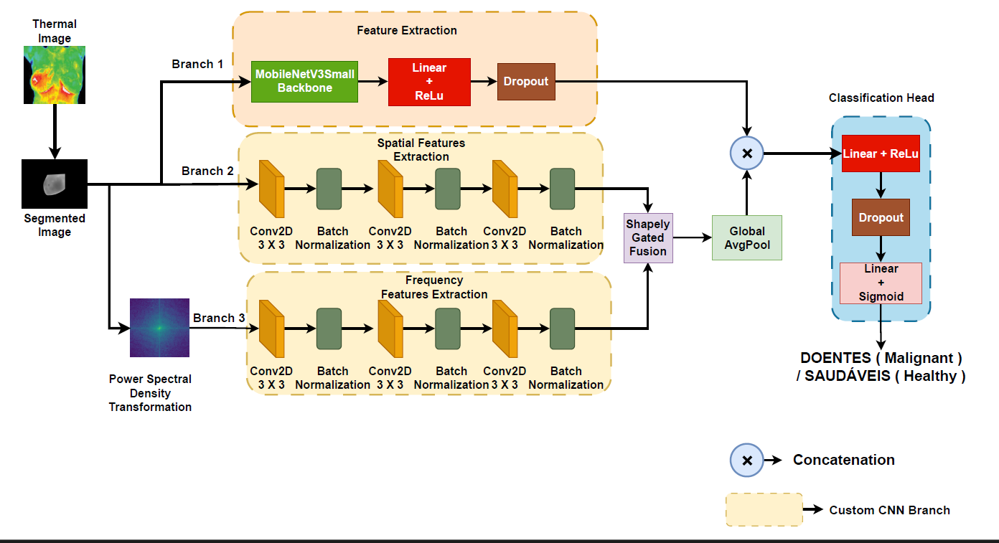

# A Shapley Value-based Gated Feature Fusion of Multi-branch Deep Learning Framework for Breast Cancer Screening of Thermal Images

  
📄 Accepted at the **4th International Conference on Artificial Intelligence over Infrared Images for Medical Applications (AIIIMA 2025)**

---

## 📝 Overview
This repository contains the official implementation of our paper:  
**"A Shapley Value-based Gated Feature Fusion of Multi-branch Deep Learning Framework for Breast Cancer Screening of Thermal Images"**  

We propose a **multi-branch hybrid deep learning framework** that simultaneously processes:
- Spatial-domain thermograms  
- Frequency-domain Power Spectral Density (PSD) representations  

A novel **Shapley Value-based Gated Fusion mechanism** adaptively integrates these features using a lightweight **MobileNetV3Small** backbone, achieving **state-of-the-art performance** on the **DMR-IR dataset**.

---

## 🚀 Key Features
- Multi-branch CNN framework for **joint spatial-frequency feature learning**  
- **Shapley Value-based Gated Fusion** for adaptive feature integration  
- Lightweight backbone (**MobileNetV3Small**) for efficiency in resource-constrained settings  
- Achieved **100% accuracy, precision, recall, and F1-score** on the **DMR-IR dataset**  

---

## 📊 Visualizations
### Model Architecture

  

### Grad-CAM Interpretability

  

---

## 📂 Dataset
We use the **DMR-IR dataset** (Database for Mastology Research with Infrared Images):  
- Collected at the University Hospital of the Federal University of Fluminense, Brazil  
- Includes **640×480** thermal breast images from **32 patients**  
- Categories:
  - **Saudáveis (Healthy)**  
  - **Doentes (Pathological/Malignant)**  
- Data was split into **80% training** and **20% testing** with stratification  

---
